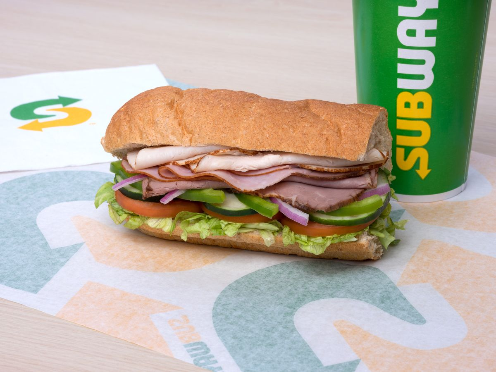

## Recurring unpleasant code

Have you ever written code that seems extremely disorganized, unpleasant to look at, and you just have no idea how to make it look nice? And has this coding problem come up over and over again? Look no further, design patterns can be the solution! Thanks to design patterns, you can tackle recurring coding mess problems! There are an abundance of design patterns to choose from, such as: Builder, Factory, Prototype, and Singleton patterns. 

## Builder design pattern: Like ordering at Subway

Let’s dive into the Builder design pattern. A good example of a Builder design pattern is let’s say you’re ordering a sandwich from Subway. You could order a default sandwich from the menu and not customize the sandwich at all. On the other hand, you could start with a default sandwich, let’s say a Spicy Italian sandwich and you can select the bread, cheese, vegetables, and sauces. This is a Builder pattern, creating an object with baseline attributes and making the changes to your liking. Like always you could just have the base object with no modifications, just like a sandwich straight from the Subway menu without changes. This is just one taste of a design pattern. As you can see, design patterns can offer this whole new avenue to code cleanliness and organization you thought was never possible if you had not done some research on design patterns. It’s possible that there exists a design pattern that fits your problem.

## Design patterns I have used in my code

Some design patterns I have used in my code are the Builder, Singleton, and Model View Controller design patterns. The Builder design pattern is something I have only ever implemented once, but have used many times from an imported dependency, such as customizing an HTML sanitizer. I have used the Singleton design pattern while creating collections in MongoDB. Each collection can only be created once, but is used everywhere that collection is needed. The Singleton collection will always hold the same data wherever it is being used. I have used the Model View Controller design pattern when I learned a Javascript framework, Angular.js. That framework was based entirely on that design pattern. All in all, design patterns are used extensively everywhere, and you might not even know it.

