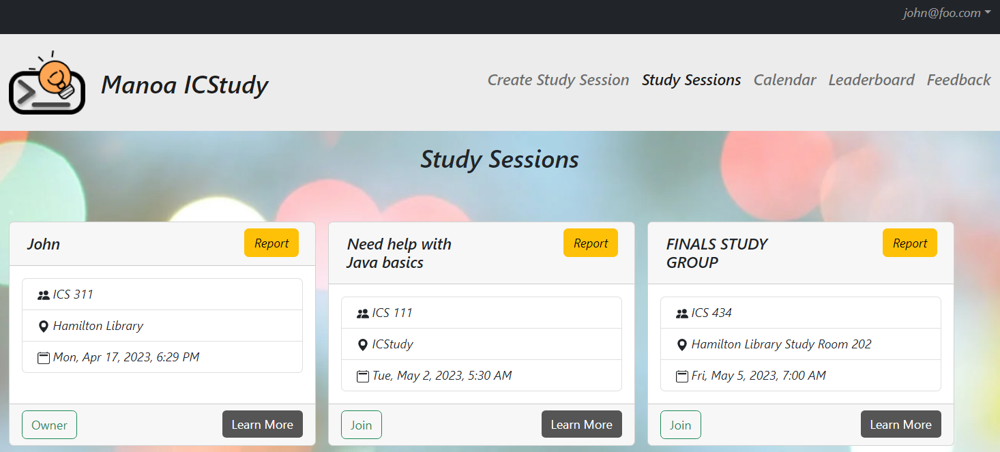
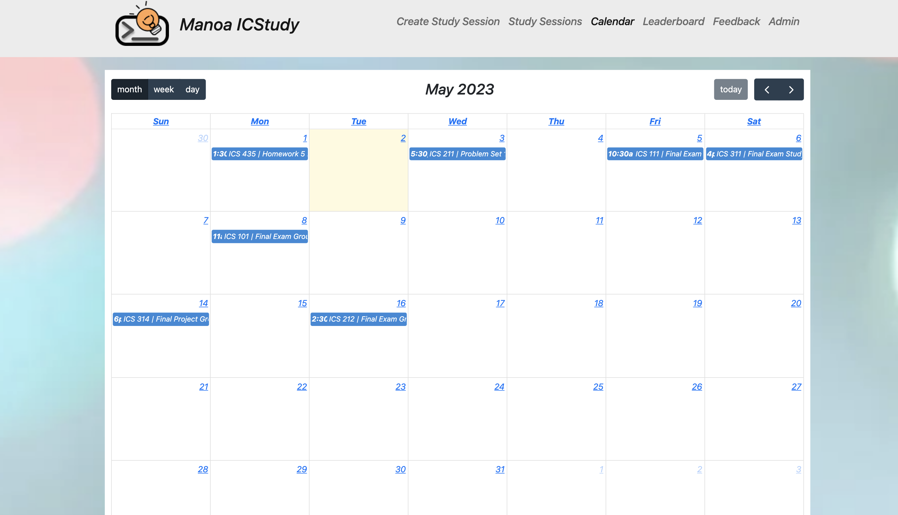
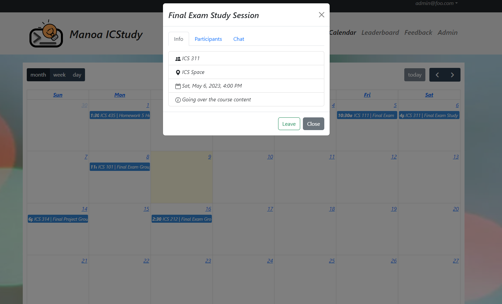
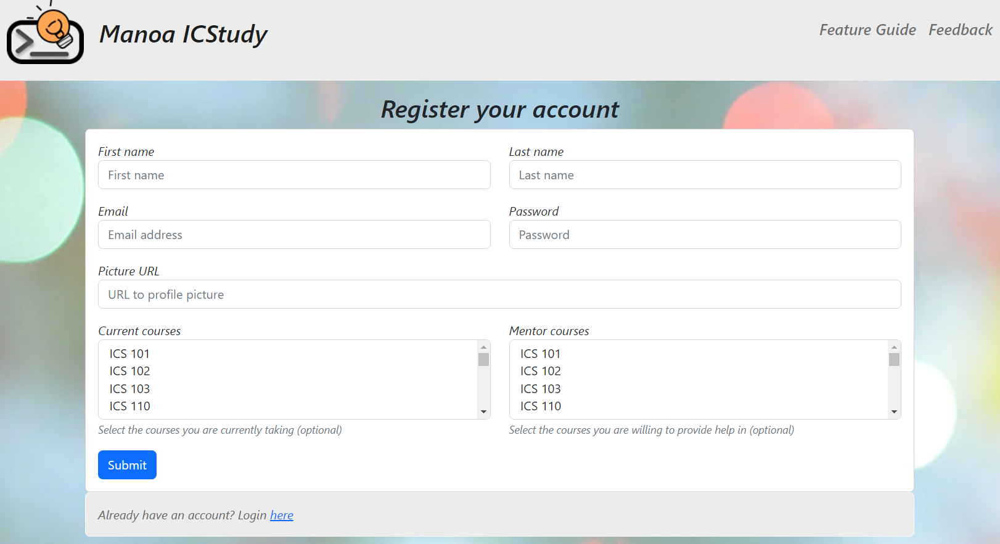
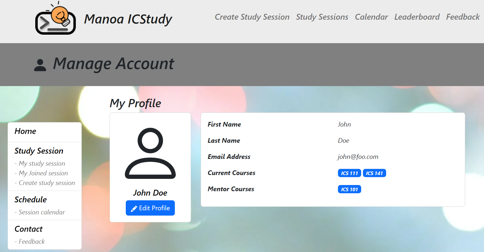
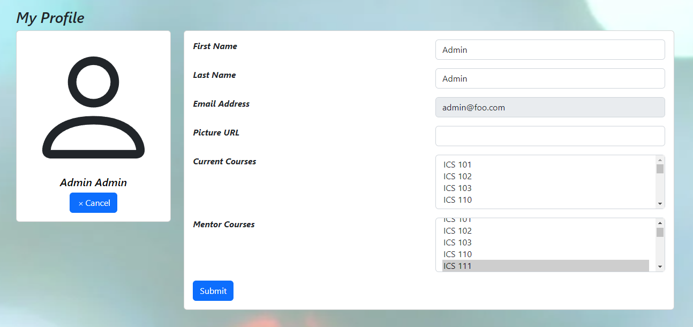

  

This is a website for UH Manoa ICS students to create and join study sessions. Start by registering and setting your user profile with information about the ICS courses you are currently taken and courses that you will are willing to serve as mentor in. Next you can join any of the available study sessions or create your own. You can create a study session and set the ICS course, date, time, and location. Check out the calendar to see any study sessions hapenning today. The website also features a leaderboard and points system in which joining and participating in a study session will net you points in which you can redeem for prices. The goal of the website is to make creating study groups easier for ICS students.

  

    
    
  

  

    
  

  

    
    
  

In this project, I contributed the most to the Calendar and User Profile pages. For the Calendar, I used FullCalendar to make creating a calendar very easy and the hardest challenge was implementing the events to display modals upon clicking on them. In the User Profile page, using conditional rendering with React was a fun challenge. When pressing on the "Edit Profile" button, it switches out the User Profile information with input boxes which allows the user to edit the user profile without having to redirect them to a new page. 

Overall, I found this project to be extremely fun. It was a great experience learning Meteor and React as well as having great teammates throughout the duration of the group project. 

GitHub: <a href="https://manoa-icstudy.github.io/">https://manoa-icstudy.github.io/</a> 
