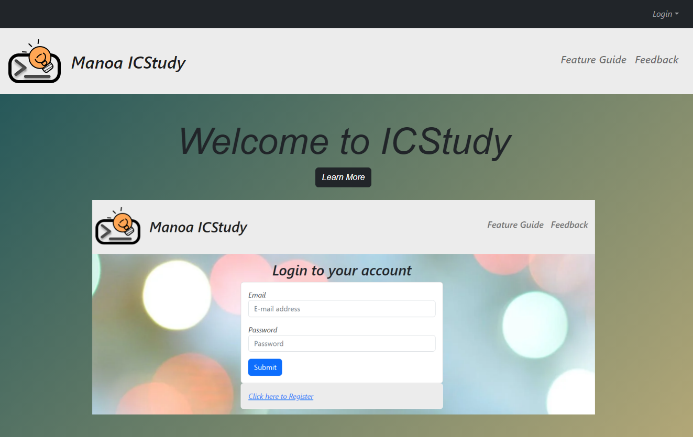

  

    
    
  

This is a website for UH Manoa ICS students to create and join study sessions. Start by registering and setting your user profile with information about the ICS courses you are currently taken and courses that you will are willing to serve as mentor in. Next you can join any of the available study sessions or create your own. You can create a study session and set the ICS course, date, time, and location. The website also features a leaderboard and points system in which joining and participating in a study session will net you points in which you can redeem for prices. 

GitHub: <a href="https://manoa-icstudy.github.io/">https://manoa-icstudy.github.io/</a> 
