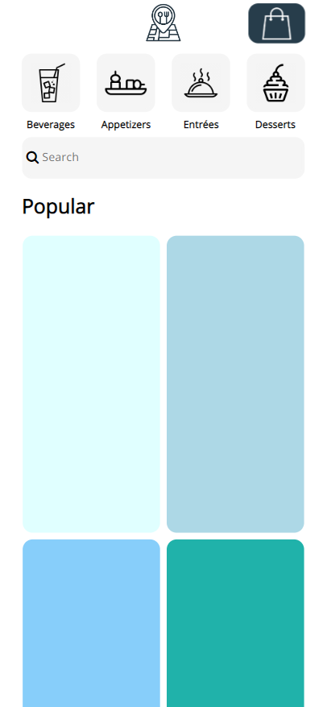
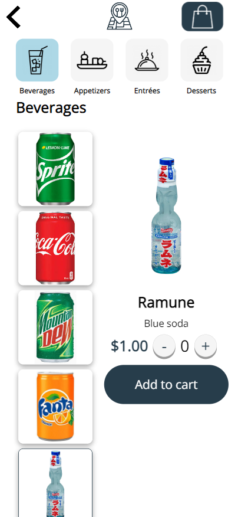
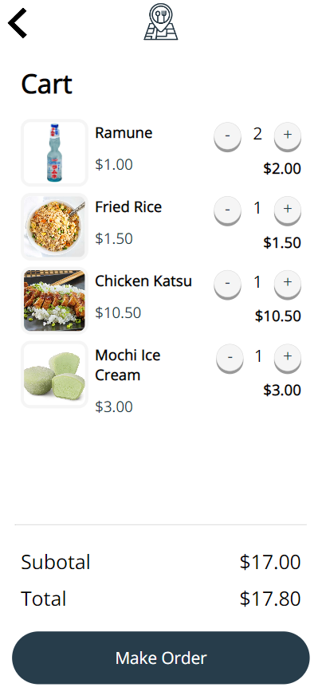

  
  
  
  

This is a web app designed for mobile devices to completely replace waiters or be a useful tool for waiters to assist them when taking orders.

Imagine walking into a waiter-less restaurant completely operated by robots. You take seat and scan the QR code at the table to immediately being ordering. Food arrives at your table by robot or a conveyer belt. You can continue ordering more food at the palm of your hands with the app. Once you are finished eating, you pay for the food through the app and you leave the restaurant. This is the vision I have in mind with this app.

This app is a personal project I completely built. It is designed on the front-end with HTML, CSS, pure Javascript, and EJS, which is a simple templating framework. On the backend, it uses Node.js, Express, and MongoDB to store all the customer's orders into a database. The orders stored on the database is then displayed in a kitchen view showing the order at which table, the time elapsed since order, and the ability to close the ticket.

In the future, I plan to upgrade this project on the front-end using React.js and Boostrap so that the app supports both desktop and mobile views. I also plan to use the data stored in the database to run a recommendation algorithm to suggest other foods they may enjoy for returning customers.

GitHub: <a href="https://manoa-icstudy.github.io/">https://manoa-icstudy.github.io/</a> 
