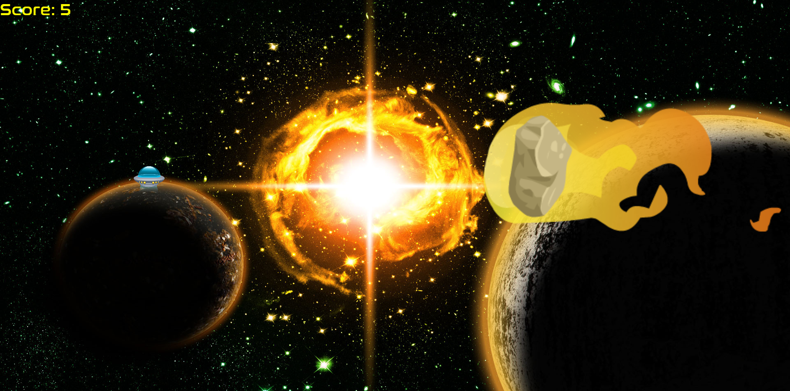

SpaceHop is a game I developed in Javascript and the p5.js library for a coding class I took in high school.

You are driving a spaceship in space during a meteor shower while a blackhole is pulling you down from below. Navigate through the madness and survive as long as possible.

In this project, I learned about creating 2D games in Javascript and p5.js. This game incorpates flappy-bird-like mechanics and the ASD keys to navigate left, right and straight down. The spacebar acts like a flappy-bird jump where you must keep on pressing it stay afloat. In a 2D game, the XY plane is used to control the positions of the player and any objects. Collision math is then used to determine whether the player was hit by a meteor or not. I learned a game's visuals and audio are very important to create a captivating gaming experience.

Source: <a href="https://github.com/JorWo/SpaceHopGame"><i class="large github icon"></i>jorwo/SpaceHopGame</a> 
Play: <a href="https://jorwo.github.io/SpaceHopGame">jorwo.github.io/spaceHopGame</a>
